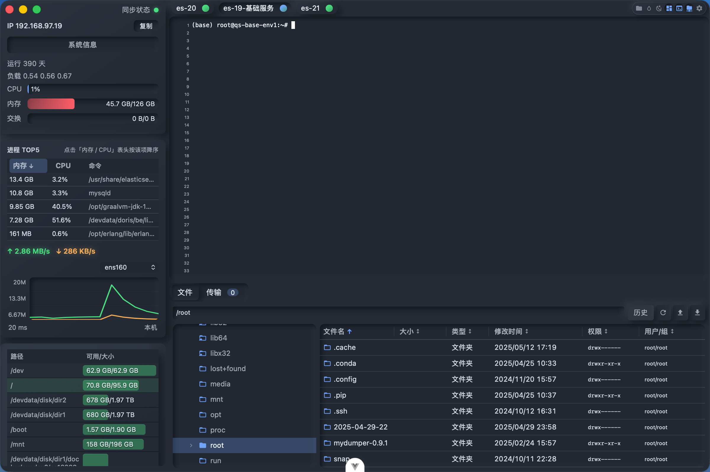
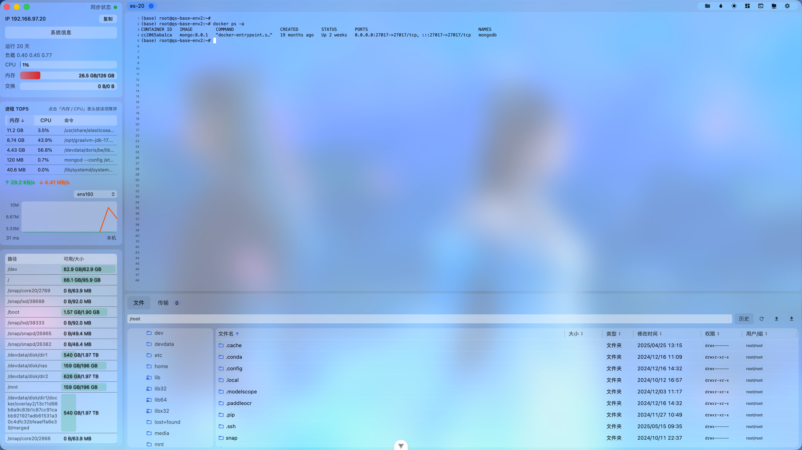
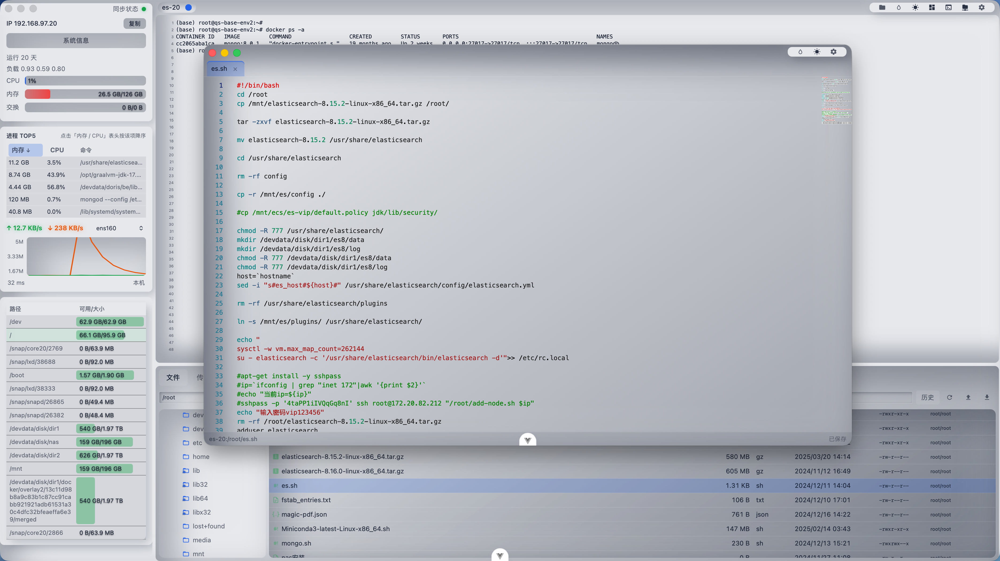
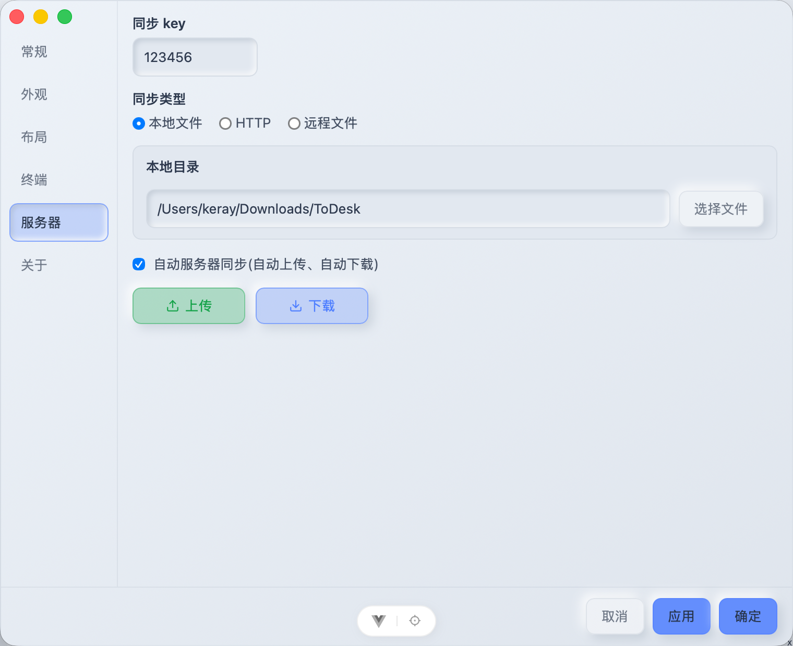
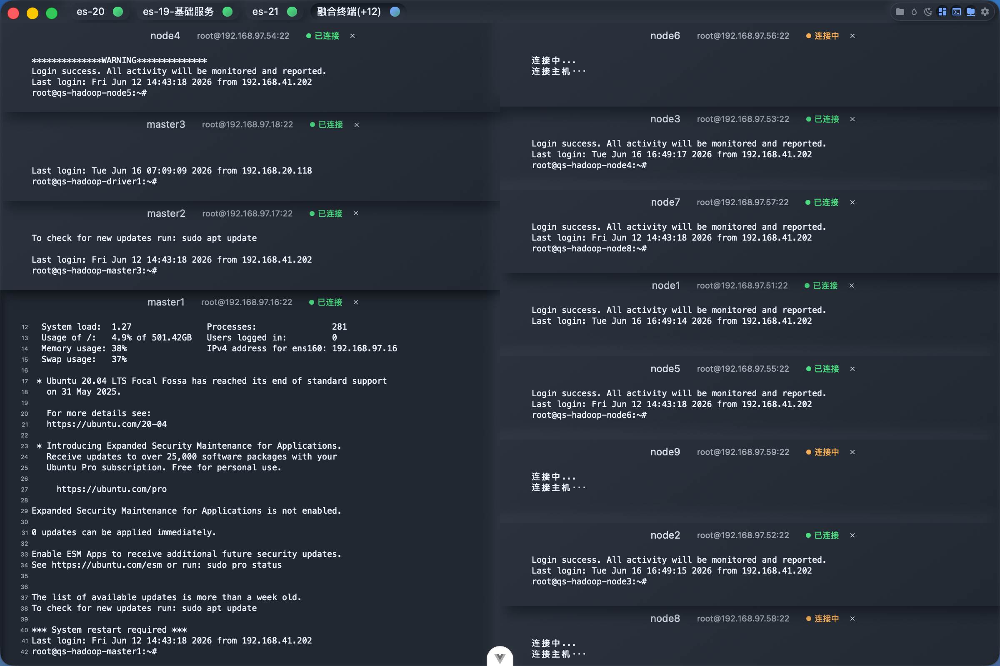

# Keray Shell Rust

一个基于 Tauri 2、Vue 3 和 Rust 的现代桌面 SSH/SFTP 客户端。Keray Shell Rust 面向日常服务器运维、远程文件管理、多会话开发和批量监控场景，重点放在启动速度、原生窗口体验、清爽界面、跨窗口协作和可控的数据管理上。


## 预览

### 拟态风格



### 毛玻璃风格



### 在线文本编辑



### 服务器数据同步



### 融合终端



### 融合监控


## 项目亮点

- 原生桌面体验：使用 Tauri 2 构建，前端体验灵活，系统能力由 Rust 提供。
- SSH 与 SFTP 一体化：终端会话、远程目录、文件表格、传输任务和在线编辑在同一个工作流中完成。
- 多会话与多窗口协作：支持服务器快速连接、最近连接、会话切换、标签拖拽分离、新窗口打开和融合回主窗口。
- 融合终端：可将多台服务器会话放入同一个终端工作区，适合批量执行命令和对比输出。
- 融合监控：可从服务器列表批量打开多台服务器监控，并按需组合系统、进程、网络和磁盘模块。
- 可定制界面：内置拟态、毛玻璃等视觉风格，支持深浅色、紧凑模式、终端字体和布局偏好。
- 远程编辑：集成 Monaco Editor，适合直接查看和编辑远程文本文件。
- 远程状态洞察：提供服务器 CPU、内存、磁盘、网络、系统信息和进程资源概览，监控数据绑定到具体 SSH 会话实例。
- 数据同步：服务器配置支持本地目录、HTTP 和远程文件等同步方式。
- 跨平台基础：面向 macOS、Windows 和 Linux，保留平台差异化窗口效果和系统能力适配。

## 功能概览

### SSH 终端

- 密码和私钥连接，支持私钥口令
- 多终端实例切换和会话 Tab 拖拽分离
- 终端标签右键菜单，支持关闭、关闭其他、关闭全部、新窗口打开和融合到主窗口
- 终端跨窗口移动时保留终端、SFTP 等会话状态
- 终端字体、字号、行高和 scrollback 配置
- 终端搜索、文本选择、复制粘贴和快捷交互
- 断开连接后展示提示，按键可触发重连
- 融合终端，支持多台服务器会话集中展示和操作

### 服务器监控

- 单机监控展示运行时长、负载、CPU、内存、磁盘、网络和进程 TOP5 概览
- 融合监控支持批量打开多台服务器的监控面板
- 监控配置栏支持选择系统、进程、网络、磁盘模块
- 支持调整监控卡片宽度、磁盘区域高度和磁盘路径过滤
- 监控数据按 SSH 会话实例独立轮询和清理，减少多会话切换时的数据串扰

### SFTP 文件管理

- 远程目录树和文件列表浏览
- 文件表格排序、列宽调整和多选操作
- 新建文件/文件夹、重命名、删除、复制路径、复制/剪切移动
- 本地文件/文件夹上传、远程文件下载和传输任务展示
- 传输任务支持进度上报、暂停、取消、覆盖确认和续传处理
- 上传冲突确认和覆盖处理，目录上传会保留相对路径
- 文件权限编辑
- 内置 Monaco 文本编辑器打开远程文本文件，也可调用系统关联应用打开文件
- 支持空文件在线编辑或通过系统应用编辑后同步写回远端

### 服务器管理

- 服务器新增、编辑、删除和分组管理
- 最近连接和快速连接
- 快速搜索名称、IP、用户和分组路径
- 服务器数据导入、导出和本地目录/HTTP/远程文件同步
- 私钥新增、编辑、删除、文件导入和口令管理

### 界面与窗口

- 多窗口架构
- 主窗口保留服务器列表，非主窗口在最后一个标签关闭后自动销毁
- Windows 自定义标题栏
- Windows 显示缩放场景下的拖拽坐标适配
- macOS 原生窗口效果，并优化新窗口打开体验
- 拟态和毛玻璃主题
- 融合监控在拟态和毛玻璃主题下提供独立卡片、配置栏、按钮和输入框样式
- 紧凑布局和可拖拽面板尺寸
- 自定义确认框、提示框、右键菜单和全局加载反馈

## 技术栈

| 模块     | 技术                                |
| -------- | ----------------------------------- |
| 桌面框架 | Tauri 2                             |
| 后端能力 | Rust 2021, Tokio, russh, russh-sftp |
| 前端框架 | Vue 3, TypeScript, Vite             |
| 状态管理 | Pinia                               |
| 终端     | xterm.js                            |
| 编辑器   | Monaco Editor                       |
| 样式     | SCSS, Tailwind CSS                  |

## 环境要求

- Node.js `^20.19.0` 或 `>=22.12.0`，以 `package.json` 中 `engines` 为准
- pnpm
- Rust stable
- Tauri 2 所需的系统依赖

macOS、Windows 和 Linux 的 Tauri 系统依赖不同，请先参考 Tauri 官方文档准备本机环境。

## 快速开始

安装依赖：

```bash
pnpm install
```

启动桌面开发环境：

```bash
pnpm tauri dev
```

只启动前端开发服务：

```bash
pnpm dev
```

## 构建与检查

前端类型检查和生产构建：

```bash
pnpm build
```

Tauri 应用打包：

```bash
pnpm tauri build
```

代码检查：

```bash
pnpm lint
```

Rust 检查：

```bash
cd src-tauri
cargo check
```

同步应用版本号：

```bash
pnpm set-version 0.1.6
```

该脚本会统一更新前端、Tauri 配置和 Cargo 相关版本号，避免发布前多处版本不一致。

macOS 可使用项目脚本生成带安装说明的 DMG：

```bash
./build-macos.sh
```

该脚本会先构建 `.app`，再通过 `create-dmg` 将应用和 `src-tauri/dmg/安装说明.pdf` 打包到 DMG 中。

## 项目结构

```text
.
├── build-macos.sh       # macOS DMG 打包脚本
├── src/                 # Vue 前端代码
│   ├── components/      # UI 与业务组件
│   ├── composables/     # 组合式逻辑
│   ├── stores/          # Pinia 状态
│   ├── styles/          # 全局样式与主题
│   └── utils/           # 前端工具函数
├── scripts/             # 版本同步等项目脚本
├── src-tauri/           # Tauri/Rust 后端代码
│   ├── capabilities/    # Tauri 权限配置
│   ├── dmg/             # macOS DMG 安装说明资源
│   ├── icons/           # 应用图标
│   └── src/             # Rust 命令与平台能力
├── docs/images/         # 项目截图
└── public/              # 静态资源
```

## 开源前说明

本项目会处理 SSH 密码、私钥和服务器地址等敏感信息。开源版本中的本地配置加密主要用于避免明文直接展示，不应被视为系统级密码保险箱。请勿把真实服务器配置、私钥、构建产物或本地调试数据提交到仓库。

正式发布前建议按 [docs/OPEN_SOURCE_CHECKLIST.md](docs/OPEN_SOURCE_CHECKLIST.md) 逐项确认，尤其是许可证、第三方资源、敏感配置、构建产物和发布渠道。

## 安全

发现安全问题时，请不要直接公开漏洞细节。请先阅读 [SECURITY.md](SECURITY.md)，并通过维护者提供的私下渠道联系。

## 贡献

欢迎提交 issue、讨论和 pull request。开始贡献前请阅读：

- [CONTRIBUTING.md](CONTRIBUTING.md)
- [CODE_OF_CONDUCT.md](CODE_OF_CONDUCT.md)
- [SUPPORT.md](SUPPORT.md)

## 许可证

本项目使用 [MIT License](LICENSE)。
