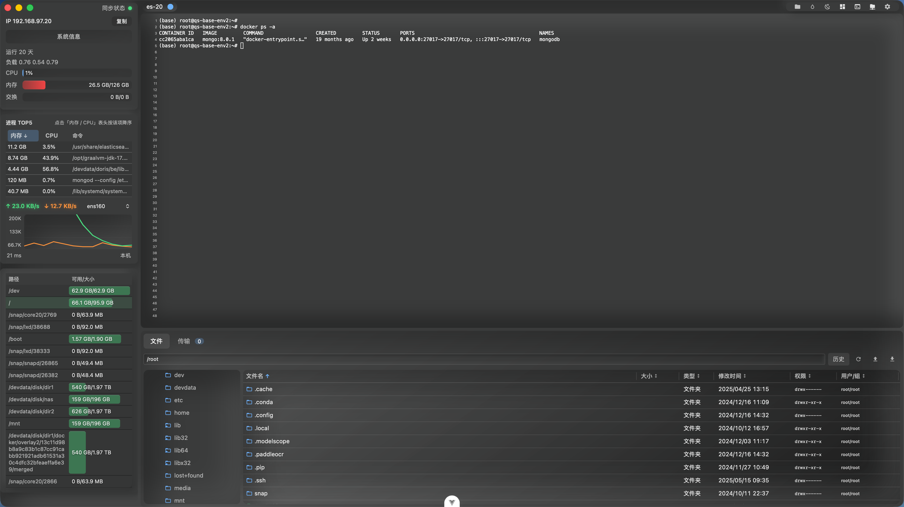
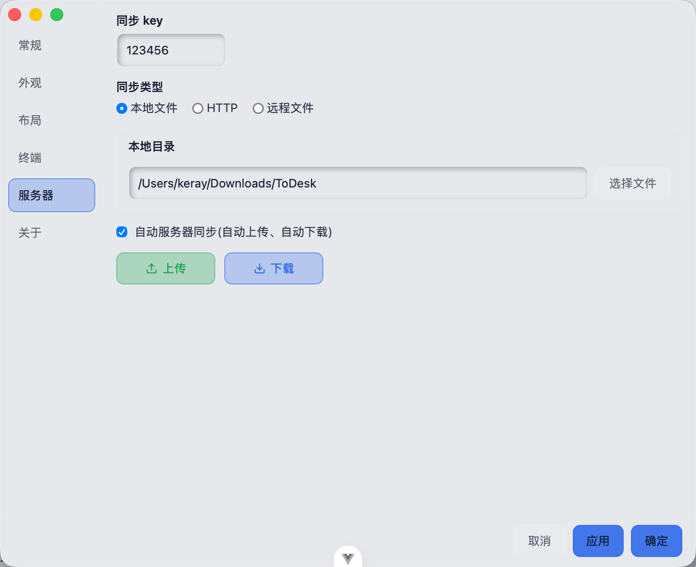

# Keray Shell Rust

一个基于 Tauri 2、Vue 3 和 Rust 的现代桌面 SSH/SFTP 客户端。Keray Shell Rust 面向日常服务器运维、远程文件管理和多会话开发场景，重点放在启动速度、原生窗口体验、清爽界面和可控的数据管理上。


## 预览

### 拟态风格



### 毛玻璃风格


### 在线文本编辑


### 服务器数据同步



## 项目亮点

- 原生桌面体验：使用 Tauri 2 构建，前端体验灵活，系统能力由 Rust 提供。
- SSH 与 SFTP 一体化：终端会话、远程目录、文件表格、传输任务在同一个工作流中完成。
- 多会话管理：支持服务器快速连接、最近连接、会话切换和窗口间协作。
- 可定制界面：内置拟态、毛玻璃等视觉风格，支持深浅色、紧凑模式、终端字体和布局偏好。
- 远程编辑：集成 Monaco Editor，适合直接查看和编辑远程文本文件。
- 数据同步：服务器配置支持本地目录、HTTP 和远程文件等同步方式。
- 跨平台基础：面向 macOS、Windows 和 Linux，保留平台差异化窗口效果和系统能力适配。

## 功能概览

### SSH 终端

- 密码和私钥连接
- 多终端实例切换
- 终端字体、字号、行高和 scrollback 配置
- 终端搜索、选择和快捷交互
- 服务器资源概览面板

### SFTP 文件管理

- 远程目录树
- 文件列表浏览
- 上传、下载和传输任务展示
- 文件权限编辑
- 远程文本文件在线编辑

### 服务器管理

- 服务器分组
- 最近连接
- 快速搜索名称、IP、用户和分组路径
- 服务器数据导入、导出和同步
- 私钥管理

### 界面与窗口

- 多窗口架构
- Windows 自定义标题栏
- macOS 原生窗口效果
- 拟态和毛玻璃主题
- 紧凑布局和可拖拽面板尺寸

## 技术栈

| 模块     | 技术                                |
| -------- | ----------------------------------- |
| 桌面框架 | Tauri 2                             |
| 后端能力 | Rust 2021, Tokio, russh, russh-sftp |
| 前端框架 | Vue 3, TypeScript, Vite             |
| 状态管理 | Pinia                               |
| 终端     | xterm.js                            |
| 编辑器   | Monaco Editor                       |
| 样式     | SCSS, Tailwind CSS                  |

## 环境要求

- Node.js 22，或满足 `package.json` 中 `engines` 的版本
- pnpm
- Rust stable
- Tauri 2 所需的系统依赖

macOS、Windows 和 Linux 的 Tauri 系统依赖不同，请先参考 Tauri 官方文档准备本机环境。

## 快速开始

安装依赖：

```bash
pnpm install
```

启动桌面开发环境：

```bash
pnpm tauri dev
```

只启动前端开发服务：

```bash
pnpm dev
```

## 构建与检查

前端类型检查和生产构建：

```bash
pnpm build
```

Tauri 应用打包：

```bash
pnpm tauri build
```

代码检查：

```bash
pnpm lint
```

Rust 检查：

```bash
cd src-tauri
cargo check
```

## 项目结构

```text
.
├── src/                 # Vue 前端代码
│   ├── components/      # UI 与业务组件
│   ├── composables/     # 组合式逻辑
│   ├── stores/          # Pinia 状态
│   ├── styles/          # 全局样式与主题
│   └── utils/           # 前端工具函数
├── src-tauri/           # Tauri/Rust 后端代码
│   ├── capabilities/    # Tauri 权限配置
│   ├── icons/           # 应用图标
│   └── src/             # Rust 命令与平台能力
├── screenshot/          # 项目截图
└── public/              # 静态资源
```

## 开源前说明

本项目会处理 SSH 密码、私钥和服务器地址等敏感信息。开源版本中的本地配置加密主要用于避免明文直接展示，不应被视为系统级密码保险箱。请勿把真实服务器配置、私钥、构建产物或本地调试数据提交到仓库。

正式发布前建议按 [docs/OPEN_SOURCE_CHECKLIST.md](docs/OPEN_SOURCE_CHECKLIST.md) 逐项确认，尤其是许可证、第三方资源、敏感配置、构建产物和发布渠道。

## 安全

发现安全问题时，请不要直接公开漏洞细节。请先阅读 [SECURITY.md](SECURITY.md)，并通过维护者提供的私下渠道联系。

## 贡献

欢迎提交 issue、讨论和 pull request。开始贡献前请阅读：

- [CONTRIBUTING.md](CONTRIBUTING.md)
- [CODE_OF_CONDUCT.md](CODE_OF_CONDUCT.md)
- [SUPPORT.md](SUPPORT.md)

## 许可证

本项目使用 [MIT License](LICENSE)。
