# Keray Shell Rust

> 一个把 SSH 终端、SFTP 文件管理、服务器监控和 Linux 运维 Agent 放进同一工作台的跨平台桌面客户端。


Keray Shell Rust 基于 Tauri 2、Vue 3 和 Rust 构建，面向日常服务器运维、远程文件处理、多会话开发和集群巡检场景。连接服务器后，可以在一个窗口内完成命令执行、文件传输、在线编辑、监控查看与 Agent 协作。

## 主界面

多服务器融合终端与 Agent 协作：集中查看多个 SSH 会话，并在侧栏中让 Agent 结合当前上下文辅助排障和执行任务。

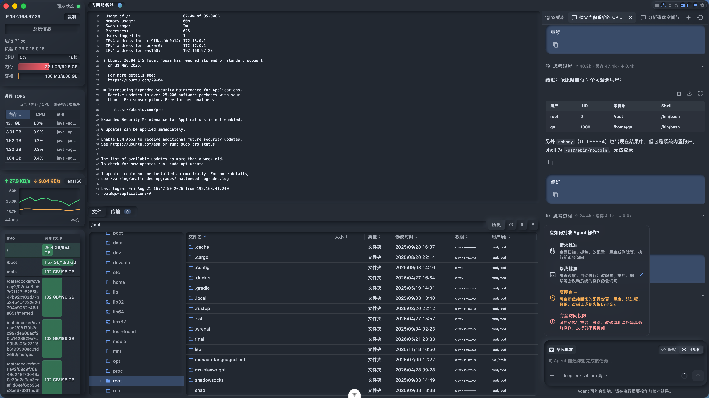

## 功能一览

### 连接、终端与窗口

- 支持密码、私钥和私钥口令连接，提供最近连接、快速连接与服务器分组搜索。
- 多终端 Tab 可切换、拖拽分离、新窗口打开或重新融合；跨窗口移动时保留终端与 SFTP 会话状态。
- 融合终端可在同一工作区中并列操作多台服务器，适合批量执行命令和比对输出。
- 支持终端搜索、复制粘贴、字体、字号、行高和 scrollback 等偏好设置。

### SFTP、传输与远程编辑

- 浏览远程目录树和文件列表，支持排序、多选、新建、重命名、移动、删除、权限编辑与路径复制。
- 支持本地文件/文件夹上传、远程文件下载，以及进度、暂停、取消、覆盖确认和续传处理。
- 内置 Monaco Editor，可直接编辑远程文本文件；也可调用系统关联应用，保存后同步写回远端。
- 服务器配置可通过本地目录、HTTP 或远程文件同步。

### 监控与多服务器协作

- 单机监控展示运行时长、负载、CPU、内存、磁盘、网络与进程 TOP5。
- 融合监控可批量打开多台服务器，按需组合系统、进程、网络和磁盘模块。
- 监控数据按 SSH 会话实例独立轮询，避免在多会话切换时混淆数据。

### Linux 运维 Agent

- 在单机终端或融合终端中打开 Agent 侧栏，查看流式回复、思考过程、工具调用和命令执行时间线。
- 支持在后台静默执行命令，或将命令写入当前终端可视化执行；常驻命令可观察状态并按执行 ID 取消。
- 兼容 OpenAI API，可配置 DeepSeek、通义、Ollama 等模型、上下文窗口和推理深度。
- 可管理内置及自定义 Skills，并支持文件附件、粘贴截图、上下文用量显示和对话压缩。
- Agent 按 R0–R4 风险分级和当前访问限制执行远程命令；高风险操作会按授权策略处理。

### 界面与体验

- 内置拟态、毛玻璃主题，支持深浅色、紧凑布局和可调整的面板尺寸。
- 提供 macOS 原生窗口效果、Windows 自定义标题栏和显示缩放下的拖拽适配。
- 主窗口保留服务器列表；非主窗口在最后一个标签关闭后自动销毁。

## 更多界面

点击缩略图可查看原图。

<p align="center">
  <a href="docs/images/拟态风格.png">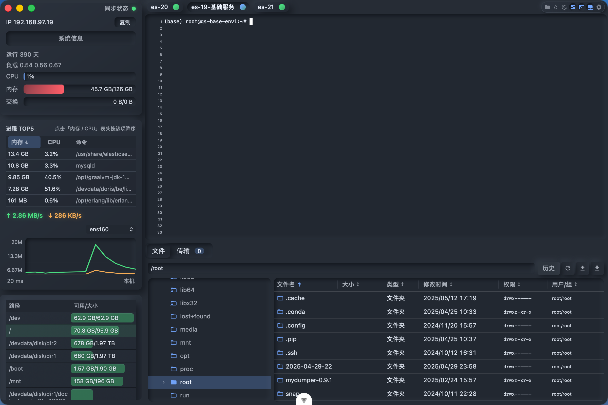</a>
  <a href="docs/images/毛玻璃风格.png">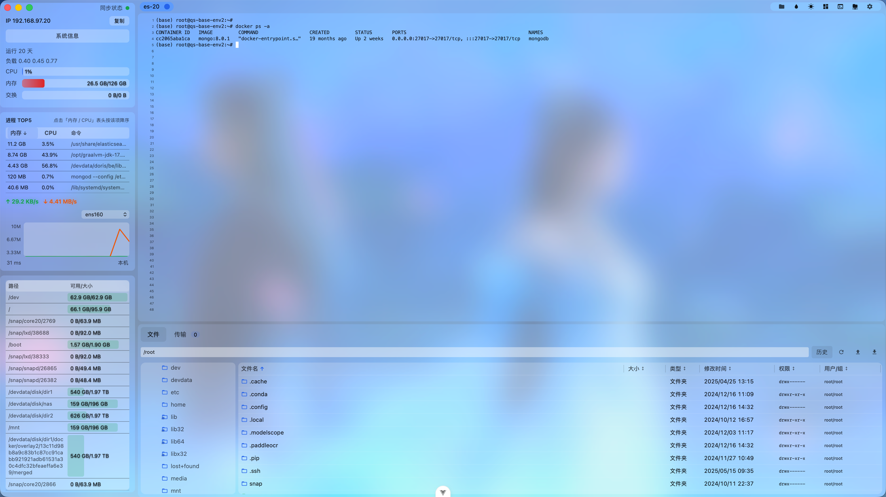</a>
  <a href="docs/images/融合终端.png">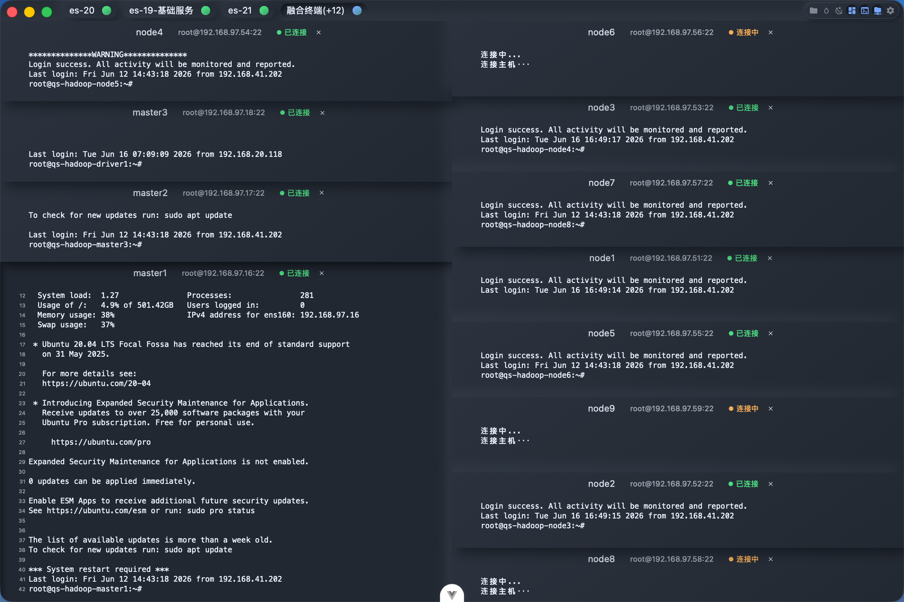</a>
</p>
<p align="center">
  <a href="docs/images/融合监控.png">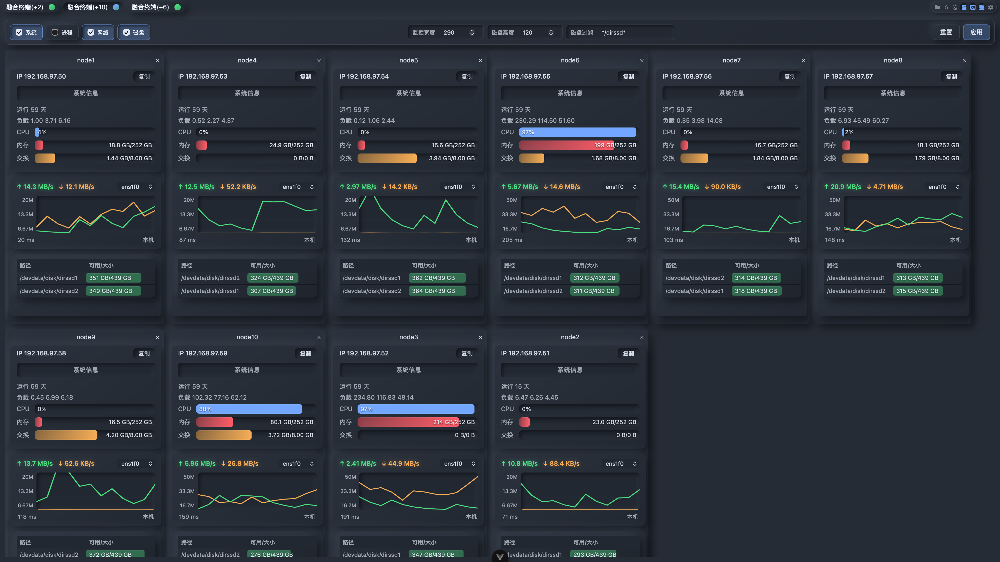</a>
  <a href="docs/images/在线文本编辑.png">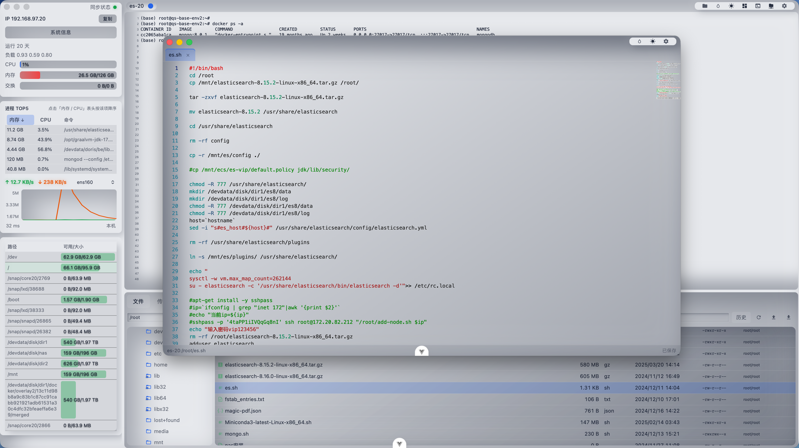</a>
  <a href="docs/images/服务器数据同步.png">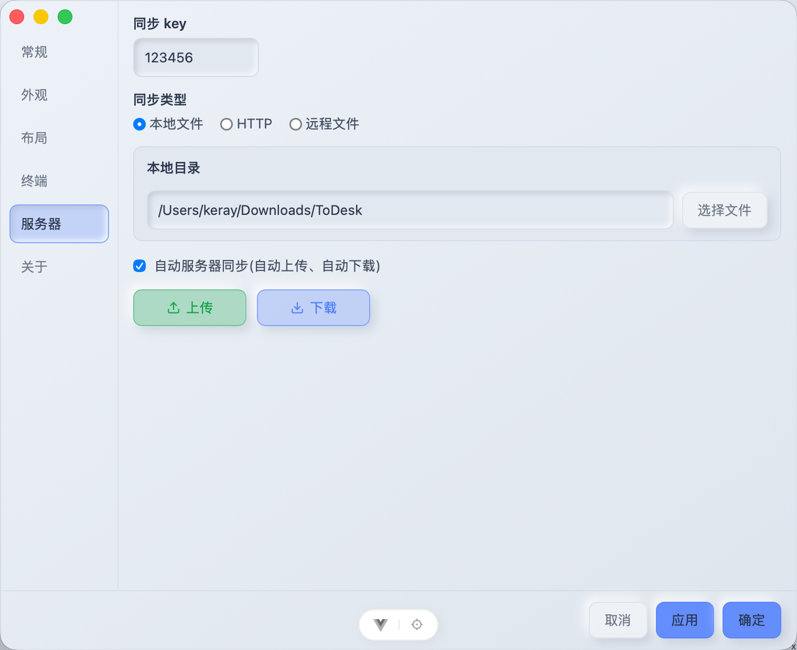</a>
</p>
<p align="center">
  <a href="docs/images/侧边栏Agent01.png">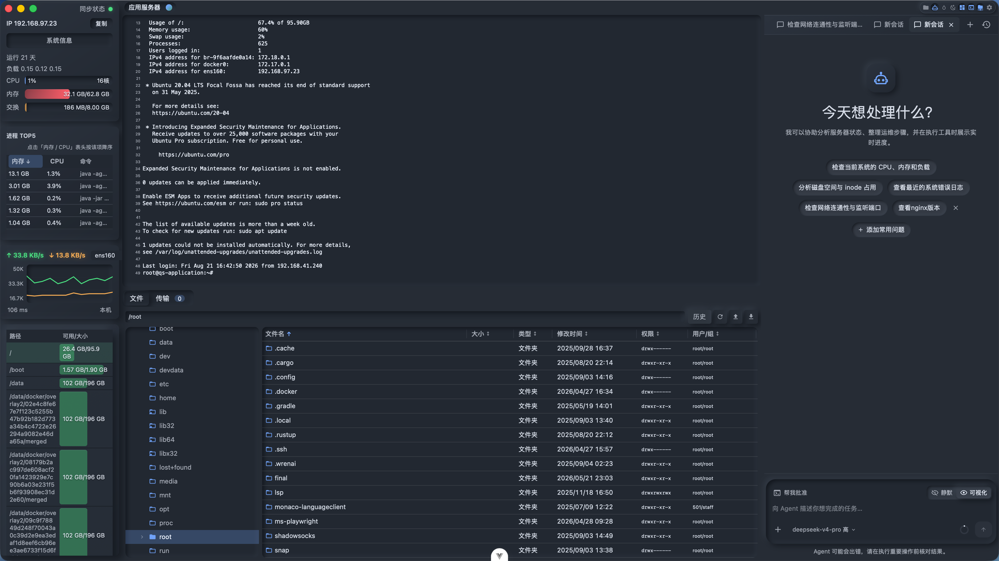</a>
  <a href="docs/images/融合终端Agent.png">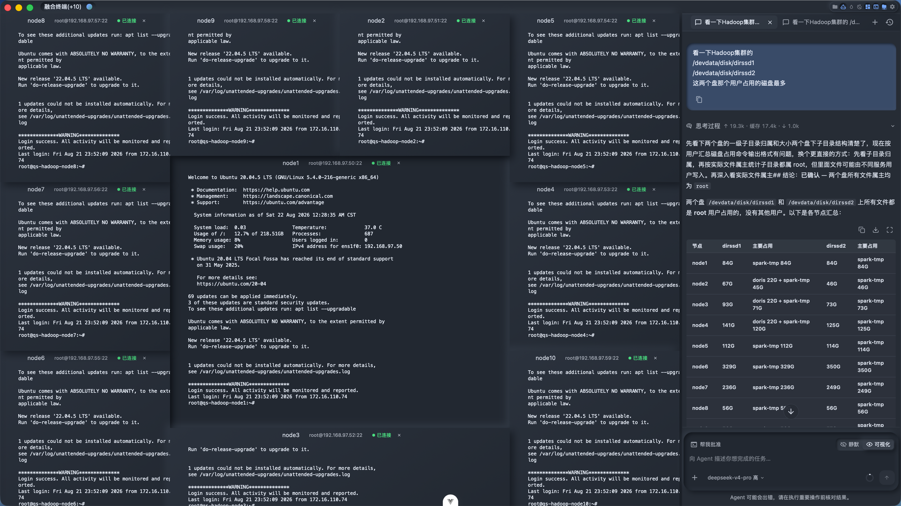</a>
  <a href="docs/images/Agent配置.png">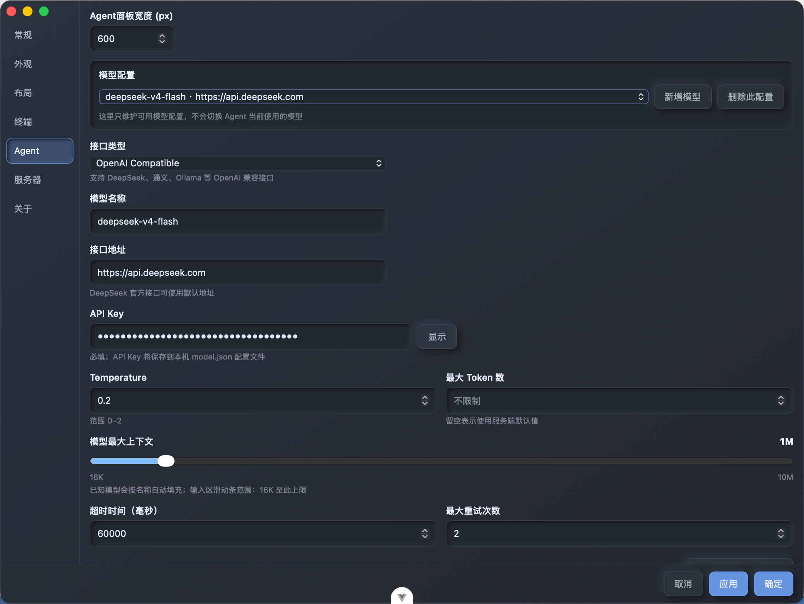</a>
</p>
<p align="center">
  <a href="docs/images/skill管理.png">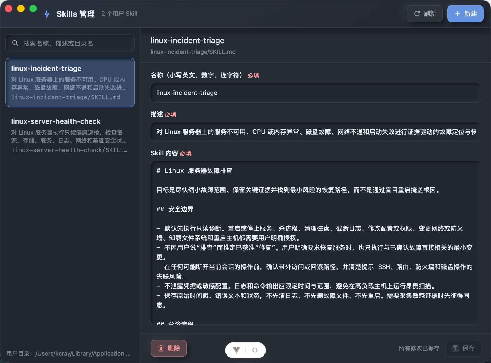</a>
</p>

## 技术栈

| 模块       | 技术                                        |
| ---------- | ------------------------------------------- |
| 桌面框架   | Tauri 2                                     |
| 后端能力   | Rust 2021、Tokio、russh、russh-sftp         |
| 前端       | Vue 3、TypeScript、Vite、Pinia              |
| 终端与编辑 | xterm.js、Monaco Editor                     |
| Agent      | LangGraph、LangChain、OpenAI Compatible API |
| 样式       | SCSS、Tailwind CSS                          |

## 开始使用

### 环境要求

- Node.js `^20.19.0` 或 `>=22.12.0`
- pnpm
- Rust stable
- 对应平台的 Tauri 2 系统依赖

macOS、Windows 和 Linux 所需的系统依赖不同；首次运行前请按目标平台准备 Tauri 2 运行环境。

### 本地开发

```bash
pnpm install

# 启动桌面开发环境
pnpm tauri dev
```

如只需启动前端开发服务：

```bash
pnpm dev
```

### 构建与检查

```bash
# 前端类型检查与生产构建
pnpm build

# Rust 检查
cd src-tauri && cargo check

# 打包桌面应用
pnpm tauri build
```

`pnpm lint` 会自动修复 ESLint 可处理的问题。发布前可通过以下命令统一同步版本号：

```bash
pnpm set-version 0.2.0
```

该脚本会更新前端、Tauri 配置和 Cargo 相关版本号。macOS 还可使用 `./build-macos.sh` 生成包含安装说明的 DMG。

## 项目结构

```text
.
├── agents/              # 内置 Agent 提示词、专题文档与 Skills
├── docs/images/         # README 项目截图
├── scripts/             # 版本同步等脚本
├── src/                 # Vue 前端
│   ├── agent/           # Agent 运行时、会话、工具与模型配置
│   ├── components/      # UI 与业务组件
│   ├── composables/     # 组合式逻辑
│   ├── stores/          # Pinia 状态
│   ├── styles/          # 全局样式与主题
│   └── utils/           # 前端工具函数
└── src-tauri/           # Tauri / Rust 后端
    ├── capabilities/    # Tauri 权限配置
    ├── dmg/             # macOS DMG 资源
    └── src/             # Rust 命令与平台能力
```

## 安全说明

本项目会处理 SSH 密码、私钥、服务器地址和 Agent API Key 等敏感信息。本地配置加密旨在避免明文直接展示，不应视为系统级密码保险箱。请勿把真实服务器配置、私钥、API Key、构建产物或本地调试数据提交到仓库。

使用 Agent 时，请根据任务风险选择适当的访问限制；即使选择高授权，也应只在受控环境中执行操作，并自行保管本机 `model.json` 中的 API Key。发现安全问题请先阅读 [SECURITY.md](SECURITY.md)，不要直接公开漏洞细节。

正式发布前，请按 [开源检查清单](docs/OPEN_SOURCE_CHECKLIST.md) 核对许可证、第三方资源、敏感配置、构建产物和发布渠道。版本变更见 [CHANGELOG.md](CHANGELOG.md)。

## 参与贡献

欢迎提交 issue、讨论和 pull request。开始前请阅读 [贡献指南](CONTRIBUTING.md)、[行为准则](CODE_OF_CONDUCT.md) 和 [支持说明](SUPPORT.md)。

## 许可证

本项目使用 [MIT License](LICENSE)。
